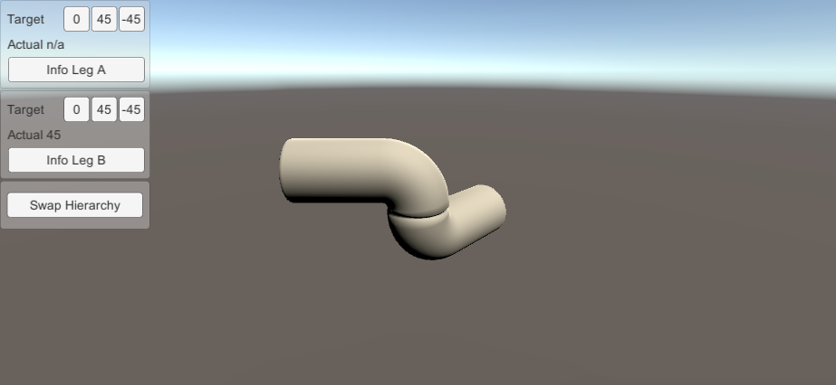

# UnityArticulationsTests

Simple test project created with Unity 2020.2.0a15.1993 to test articulations. 

# Instructions

Clone repository, open in aforementioned Unity editor.

# Goal

I need to change the hierarchy of the articulation to be able to add it to another hierarchy as a child. This test
consists of just two `ArticulationBody`s with a revolute joint. Flipping the hierarchy should ultimately result in an invisible
change to the user by maintaining all position and joint velocities.

